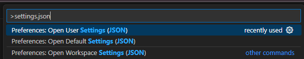

# ESP32 Geliştirme Ortamı (VS Code) Kurulumu ve Yapılandırma Dokümanı

Bu doküman, Espressif ESP32 çipleri için Visual Studio Code ortamında geliştirme yapabilmek amacıyla gerekli adımları kapsamaktadır. Kurulum, yapılandırma ve yaygın karşılaşılan sorunlar için çözüm önerilerini içermektedir. Bu rehber, ESP-IDF v5.4 ve ESP32/ESP32-C6 geliştirme kartları temel alınarak hazırlanmıştır.

---

## 1. ESP-IDF Kurulumu

1. [Espressif ESP-IDF Windows Installer](https://dl.espressif.com/dl/esp-idf/) ile ESP-IDF v5.4 sürümünü indirin ve kurun.
2. Kurulum tamamlandıktan sonra ESP-IDF framework dizini genellikle şu konumda bulunur:
   ```
   C:\Espressif\frameworks\esp-idf-v5.4
   ```
3. Python sanal ortamı ise otomatik olarak şu dizine kurulur:
   ```
   C:\Espressif\python_env\idf5.4_py3.11_env
   ```

---

## 2. VS Code Ortam Ayarları

### 2.1. settings.json Yapılandırması

1. `Ctrl+Shift+P` (veya `F1`) tuşlarına basarak **Preferences: Open User Settings (JSON)** komutunu aratın ve açın.



2. Açılan dosyada aşağıdaki ayarları terminal profiline ekleyin:

```json
"terminal.integrated.defaultProfile.windows": "Command Prompt",
"terminal.integrated.profiles.windows": {
  "PowerShell": {
    "source": "PowerShell",
    "icon": "terminal-powershell"
  },
  "Command Prompt": {
    "path": [
      "${env:windir}\\Sysnative\\cmd.exe",
      "${env:windir}\\System32\\cmd.exe"
    ],
    "args": [
      "/k",
      "C:/Espressif/idf_cmd_init.bat esp-idf-xxxxxxxxxxxxxxxxxxxxxxxxxxxxxxxx"
    ],
    "icon": "terminal-cmd"
  },
  "Git Bash": {
    "source": "Git Bash"
  }
}
```

> Not: `esp-idf-xxxxxxxxxxxxxxxxxxxxxxxxxxxxxxxx` kısmı, bilgisayarınızdaki **ESP-IDF Command Prompt** kısayolunun özelliklerinden "Target" alanında bulunan uzantıdır.

3. Ayarları kaydettikten sonra, yeni bir terminal açtığınızda aşağıdakine benzer bir çıktı görmelisiniz:

```
Activating ESP-IDF 5.4
* Checking python version ... 3.11.2
* Checking python dependencies ... OK
* Establishing a new ESP-IDF environment ... OK
Done! You can now compile ESP-IDF projects.
```

Bu, artık ESP-IDF ortamının başarıyla yüklendiği ve kullanılabilir olduğu anlamına gelir.

---
